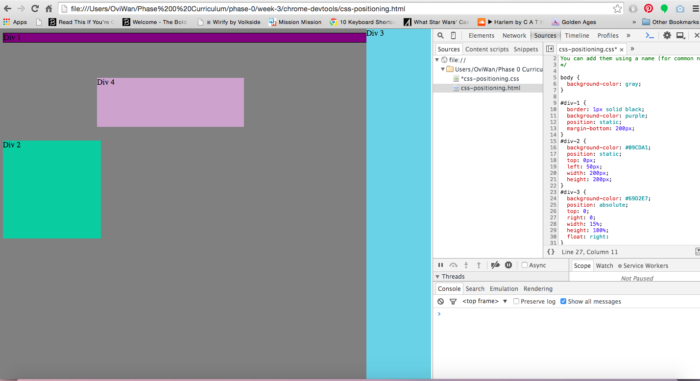

- How can you use Chrome's DevTools inspector to help you format or position elements?

You can use Chrome's DevTools inspector to help you format and position elements because it acts as an experimental mock-up that allows you to easily manipulate all your working elements in HTML/CSS to see how everything would flow together on your live site. You can change the attributes/properties of individual objects using the appropriate methods to see how things like the border and margins of individual elements collectively affect each other when placed in conjunction. It seems like a lot of CSS development involves a 'trail and error' approach to see what works, so DevTools provides an interface to see what methods work best for the design of your site.

-How can you resize elements on the DOM using CSS? 

Depending on what element we are talking about in the DOM, this would vary in CSS but for example: If you wanted to change the size of a "div" section, in CSS you could set the pixel distribution of the 'height' and 'width' of that element to "10px" and "2em" respectively. Though you can virtually change the size of any element in the DOM model, some more common examples of things that can be altered are border, padding, and margins. These are all important when formatting the layout and flow of information of a page, and how elements are visually interpreted by the user. You may even want to change minute details such as the text of a heading on your site using CSS as such: "h1 { font-size: 40px; }".

-What are the differences between Absolute, Fixed, Static, and Relative positioning? 

**Absolute:** Think of 'absolute' like gluing any page element down exactly where you want it. To use it: 1) set the location by using the positioning attributes: 'top', 'left', 'bottom', and 'right'...the values you choose for these are relative to the next parent element with relative OR absolute positioning...if there is no parent then it will refer itself to the HTML of the page itself. It is also important to consider the power of absolute postioning: though it does anchor elements down, it also puts that element into a "bubble" where is does not affect, or is affected by other elements therefore potentially making a page rather rigid.
**Fixed:** This positioning fixes an element relative to the browser window itself. When you scroll through a page that element would stay stationary in position even as you move up or down. This keeps an element in the users' sight as long as they are on a page.
**Static:** Everything starts out in static positioning; it is the default orientation of every page in CSS. As per expected, this means the elements will be presented in the the manner they normally would without any manipulation. Though this seems to be a redundant positioning property, it is useful when you want to override any unintentional positioning that got applied to an element 
**Relative:** This positioning name IS counterintuitive; it means relative *to itself*. If you set a position as 'relative' without any further positioning attributes (ie, right, top, etc.) the position will be static and nothing will change. If you do change it to for example, "top: 5px;" the position of the the element will shift 5 pixels down from where it would **normally** be. 

-Which did you find easiest to use? Which was most difficult?

I would have to say they were all conceptually difficult to use until you started playing around with them to see what they actually do.  Depending on the numerous changes you can apply to the properties of an object, all can have intended/unintended effects on the positioning of your page's elements. The most confusing of all of them would probably have to be 'relative' positioning because it actually means 'positioning relative to itself' as opposed to other objects on a page.

-What are the differences between Margin, Border, and Padding?

The elements of margin, border, and padding comprise the "Box Model" in CSS. In this model at the center of everything is your actual content; this could be images, text, footers, div, sections, etc. The content are the objects that populate your page. Surrounding this potentially is a transparent cushion called the 'padding'; this acts as a buffer zone between the inner content, and the "outer-wall" known as the 'border'. The border is exactly that; it is visible division between content and everything else on the page. Outside of the border of an object is another transparent-cushion layer called the 'margin'. This clears a layer outside of the border and spaces out that object content from other elements on the page.

-What was your impression of this challenge overall? (love, hate, and why?)

I don't like say it, but I hated this challenge. I found it incredibly and unnecessarily time-consuming. I understand that a lot of CSS can be a dynamic and experimental process, but I felt that there could have been a little more guidance in the instruction of the individual exercises; some of the prompts were a little too vague. I think I do a good job researching things when I don't know what to do, but when in comes to formatting elements in CSS there are such a limitless number of approaches to how you can do things, so that added to the difficulty of figuring out how to get the dersired result. Also there was a little bit of learning curve to using the Chrome DevTools platform for the first time; some of the things were more intuitive than others, but I still have trouble navigating this particular interface. I read up on some of DevTools but there is still a lot I don't understand about it; It is easy to get sidetracked from the assignment at hand in these situations, so I bookmarked those resources, and decided to come back to it later as needed.

